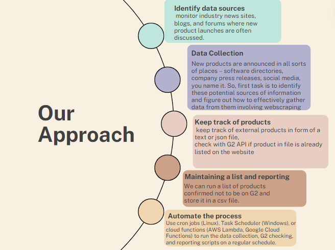

# G2 Product Listing Automation

This project automates the fetching of software product data from G2 and Product Hunt, compares the datasets to find unique entries in Product Hunt that are not listed in G2, and outputs these unique product names to a CSV file. It is intended to help users identify new software products on Product Hunt that may be potential candidates for inclusion on the G2 platform.
# Approach:


## Project Structure

- `fetch_and_compare.py`: Main script that integrates fetching data from G2, fetching data from Product Hunt, comparing the data, and saving the results.
- `requirements.txt`: Contains all Python dependencies for the project.
- `output/`: Directory where the output CSV file `unique_names.csv` is stored after script execution.

## Getting Started

### Prerequisites

- Python 3.6+
- pip
- Access to G2 and Product Hunt APIs (API keys required)

### Installation

1. **Clone the repository**
   ```bash
   git clone https://github.com/Sachinramesh15/G2_listing_automation.git
2. **install the packages though requirements.txt**
  - ```bash
     pip install -r requirements.txt
3. **Set up environment variables**
- Ensure you have the necessary API keys for G2 and Product Hunt. Set them as environment variables or directly in the script (not recommended for production).
  ```bash
  export G2_API_KEY='your_g2_api_key'
  export PRODUCTHUNT_TOKEN='your_producthunt_token'
The script will fetch data from both APIs, compare the data sets, and output the unique software names from Product Hunt to the output/unique_names.csv file.
## Data Comparison Using Fuzzy String Matching

The project utilizes the `fuzzywuzzy` Python library to perform fuzzy string matching, which is essential for identifying similar product names across different datasets. This method allows the system to detect products that may have slightly different names due to variations in spelling, punctuation, or abbreviation but are essentially the same.

### How It Works

1. **Extraction**: First, the script extracts product names from the JSON data retrieved from both the G2 and Product Hunt APIs.
2. **Fuzzy Matching**: For each product name from Product Hunt, the script uses `fuzzywuzzy` to find the closest match in the list of G2 product names. This comparison is based on the Levenshtein distance, which measures the difference between two sequences.
3. **Threshold Setting**: A similarity threshold is set (typically around 90%). Only matches that fall below this threshold are considered unique, indicating that no similar name exists in the G2 dataset.
4. **Results**: Products from Product Hunt that do not have a close match in G2 are compiled into a list and output to a CSV file, signifying potential new entries for G2.

This approach ensures a robust comparison mechanism, reducing the likelihood of missing closely related entries due to minor textual differences.

## Automating the Script

### Windows

To automate the script on Windows, use the Task Scheduler to set it to run at regular intervals:

1. **Search for 'Task Scheduler'** in the Start menu and open it.
2. **Create a new task**:
   - Click on 'Create Task' in the right sidebar.
   - Under the 'General' tab, give your task a name.
   - Under the 'Triggers' tab, click 'New' to set when the task should start. You can configure the task to run daily, weekly, or at any custom time interval.
   - Under the 'Actions' tab, click 'New'. Set the action to 'Start a program'. In the 'Program/script' field, browse to select your Python executable (`python.exe`). In the 'Add arguments' field, enter the path to your script, such as `fetch_and_compare.py`.
   - Under the 'Conditions' tab, you can specify additional conditions (like running the task only if the computer is on AC power).
   - Under the 'Settings' tab, you can further customize the behavior of the task (like allowing the task to be restarted if it fails).
3. **Save the Task**:
   - Click 'OK' to save your settings and create the task.

This setup will ensure your script runs automatically at the specified times without manual intervention, keeping your dataset regularly updated.

### Unix-like Systems (Linux/macOS)

For users on Unix-like systems, setting up a cron job is recommended:

1. **Open your user's crontab**:
   ```bash
   crontab -e
 Add a cron job: To schedule the script to run at regular intervals, such as daily at 3 AM, you would add the following line:
```bash
    0 3 * * * /usr/bin/python3 /path/to/fetch_and_compare.py.


